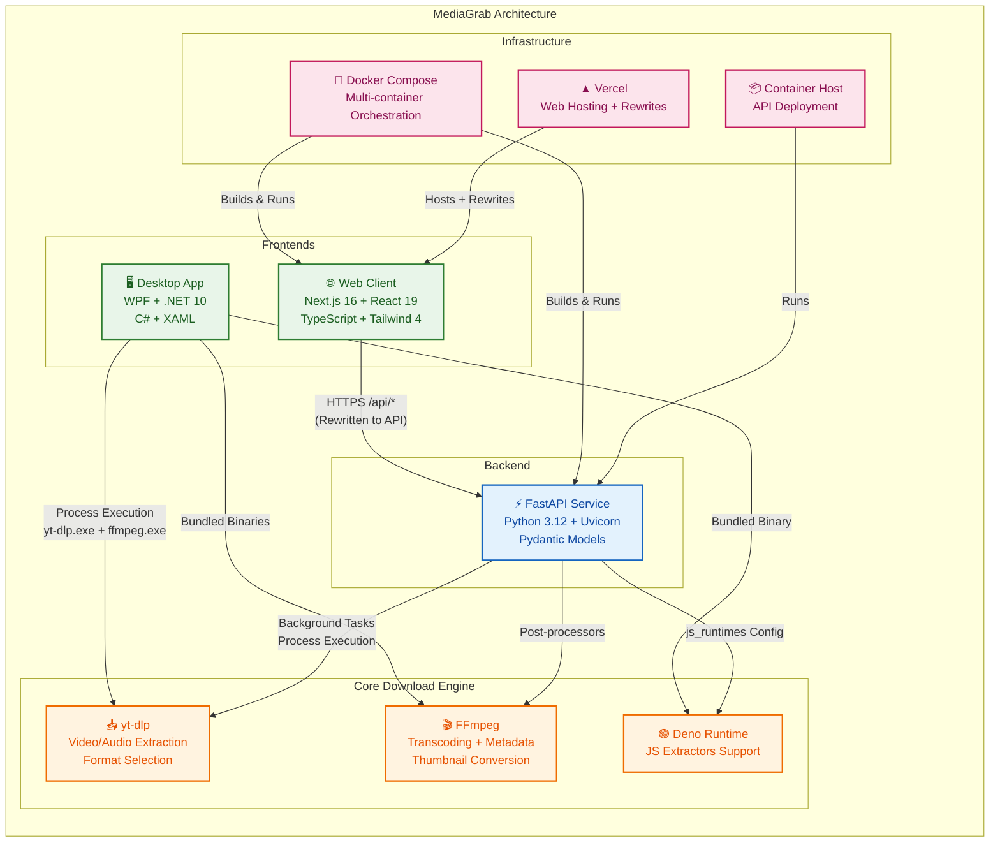

# MediaGrab → Portfolio Integration Analysis

## 1. Current MediaGrab Architecture

### Overall Architecture
**Multi-platform media downloader** with three deployment targets sharing the same core logic (yt-dlp + FFmpeg):
- **Web**: Next.js 16 (React 19) + FastAPI backend
- **Desktop**: WPF (.NET 10, WinExe)
- **API**: FastAPI (Python 3.12) with yt-dlp

### Desktop Stack
- **Framework**: WPF on .NET 10 (`net10.0-windows`)
- **UI**: XAML + C# code-behind (`MainWindow.xaml`, `MainWindow.xaml.cs`)
- **Core logic**: `DownloadService.cs` wraps `yt-dlp.exe` via `Process.Start`, parses progress output
- **Bundled tools**: `yt-dlp.exe`, `ffmpeg.exe`, `ffprobe.exe`, `deno.exe` in `Tools/` (copied to output)
- **Progress reporting**: `IProgress<DownloadProgress>` with real-time parsing of yt-dlp stdout

### Web Frontend Stack
- **Framework**: Next.js 16.3.8 (App Router, React 19.2.8)
- **Styling**: Tailwind CSS 4 + Geist font
- **Architecture**: Single-page client component (`"use client"`) with full state management
- **API communication**: `fetch` to `/api/*` rewritten to FastAPI via `next.config.ts` rewrites
- **Features**: Theme toggle (localStorage + system pref), audio/video download, quality selection, progress polling (500ms), blob download via `FileResponse`

### Backend Stack
- **Framework**: FastAPI 0.115+ on Python 3.12
- **ASGI**: Uvicorn
- **Core deps**: `fastapi`, `uvicorn[standard]`, `yt-dlp[default]`, `pydantic`
- **Job model**: In-memory `DownloadJob` dataclass with thread-safe `Lock` (`jobs.py`)
- **Endpoints**: `POST /api/jobs`, `GET /api/jobs/{id}`, `GET /api/jobs/{id}/file`, `GET /api/health`
- **Download logic**: `downloader.py` configures yt-dlp with progress hooks, FFmpeg post-processors (metadata, thumbnails, audio extraction), format selectors for audio/video
- **CORS**: Allows `localhost:3000`, `media-grab-sigma.vercel.app`, plus `ALLOWED_ORIGINS` env var

### Docker / Docker Compose
```yaml
# compose.yml
services:
  api:   # FastAPI on port 8000 (exposed internally)
    build: ./server
  web:   # Next.js standalone on port 3000 (bound to 127.0.0.1:3000)
    build: ./web
    depends_on: [api]
```
- **Server Dockerfile**: Multi-stage not used; installs Node.js 22 + Python deps + ffmpeg in single image
- **Web Dockerfile**: 3-stage (deps → builder → runner), `output: "standalone"`, non-root `nextjs` user

### Hosting
- **Web**: Vercel (rewrites to API)
- **API**: Docker container (likely VPS/self-hosted) at `api:8000` internally
- **Desktop**: Standalone `.exe` with bundled tools

### Key Technical Decisions
1. **Shared core logic**: yt-dlp + FFmpeg as the universal download engine across all three platforms
2. **In-memory job queue** with background tasks (FastAPI `BackgroundTasks`) — simple, no Redis needed for single-instance
3. **Progress via yt-dlp hooks** → parsed and pushed to job store → polled by frontend
4. **Standalone Next.js output** for minimal Docker image
5. **Bundled binaries** in desktop (yt-dlp, ffmpeg, deno) for zero-dependency install
6. **Deno as JS runtime** for yt-dlp's extractor scripts (both desktop and server)

### Notable Portfolio-Worthy Details
- **Real-time progress streaming** via yt-dlp progress hooks → FastAPI background tasks → polling frontend
- **FFmpeg post-processing pipeline**: metadata embedding, thumbnail conversion (webp/png → jpg for compatibility), audio extraction with quality mapping
- **Hybrid format selector logic**: `bv*+ba/b` for best, height-constrained fallback for specific resolutions
- **Thread-safe in-memory job store** with cleanup on file download
- **Cross-platform binary bundling** (Windows desktop + Linux server)
- **Deno integration** for yt-dlp's JavaScript extractors

### GitHub URL
`https://github.com/mohamad-hassan11/MediaGrab.git`

### Screenshots/Assets Available
- None in repo currently — would need to capture:
  - Web UI (light/dark theme)
  - Desktop WPF UI
  - Architecture diagram (3 platforms → shared yt-dlp/FFmpeg core)
  - Terminal showing `docker compose up`
  - Progress polling in action

---

## 2. Current Portfolio Project-Content Architecture

### Content Representation
- **Structured config** (`content/*.ts`): `site.ts`, `experience.ts`, `education.ts`, `skills.ts` — typed arrays/objects sorted by `order`
- **Narrative content** (`content/projects/*.mdx`): MDX files with frontmatter `metadata` export + Markdown body
- **No CMS/database** — Git is the CMS (per `AGENTS.md`)

### MDX Project Structure
Each `content/projects/<slug>.mdx`:
```tsx
export const metadata: ProjectMetadata = { ... }  // frontmatter equivalent

## Overview
## Approach
## Implementation
## What I learned
// Custom components: <Showcase>, <ProjectImage>, <ArchitectureDiagram>, <Callout>
```

### Frontmatter Fields (`ProjectMetadata`)
| Field | Type | Required | Notes |
|-------|------|----------|-------|
| `title` | string | ✓ | Display title |
| `slug` | string | ✓ | URL segment, unique |
| `summary` | string | ✓ | Card/list description |
| `projectType` | string | | e.g., "University team project" |
| `organisation` | string | | Company/client |
| `year` | number | | |
| `featured` | boolean | ✓ | Controls homepage + flagship card |
| `order` | number | ✓ | Sort order (ascending) |
| `coverImage` | string | | Path under `/public` |
| `technologies` | string[] | ✓ | Tag list |
| `githubUrl` | string \| null | | Source link |
| `liveUrl` | string \| null | | Demo link |
| `confidential` | boolean | | Hides source links, shows notice |

### Project Listing Behavior
- `getProjects()`: All projects, sorted by `order` ascending
- `getFeaturedProjects()`: Filters `metadata.featured === true`
- `ProjectList`: Renders `ProjectCard` in 2-col grid; **first featured project becomes flagship** (spans 2 cols, shows larger image)
- `ProjectCard`: Tone-cycled border (5 colors), tech tags (max 5/8), live/source links

### Project Detail Routes
- **Route**: `/projects/[slug]` (static params from `getProjects()`)
- **Component**: `CaseStudy` → renders `metadata` header + `Content` (MDX body) + `TechMarquee`
- **SEO**: `generateMetadata` uses `buildMetadata` with `coverImage` for OG

### Image Organization
- `/public/projects/<slug>/<image>.png` referenced in MDX as `/projects/<slug>/<image>.png`
- Components: `ProjectImage` (single, with tone/zoom/caption), `Showcase` (side-by-side text+image), `ArchitectureDiagram` (wide)

### Styling/Components for Project Pages
- `CaseStudy`: Header with back link, metadata line, title, summary, `ProjectLinks`, optional cover image
- `ProjectCard`: Flagship/normal variants, tone-cycled accent bar, image or numbered placeholder
- `TechMarquee`: Animated scrolling tech tags
- `TagList`: Pill tags with max + overflow
- `ProjectLinks`: Live demo (primary), Source (secondary), Confidential notice
- `Section`: Consistent section wrapper with tag/title/description/action

### Featured Project Selection & Ordering
- **Selection**: `metadata.featured === true`
- **Ordering**: By `metadata.order` ascending (lowest = first = flagship)
- **Homepage**: `FeaturedProjects` section shows only featured projects via `ProjectList`
- **Projects page**: Shows all projects, same flagship logic applies

---

## 3. Exact Files to Add/Modify for MediaGrab in Portfolio

### New Files to Create
```
Portfolio/
├── content/projects/mediagrab.mdx          # NEW: Project case study MDX
├── public/projects/mediagrab/              # NEW: Directory for images
│   ├── cover.png                           # NEW: Card/detail cover (16:9 or 16:10)
│   ├── web-ui.png                          # NEW: Web frontend screenshot
│   ├── desktop-ui.png                      # NEW: WPF desktop screenshot
│   ├── architecture.png                    # NEW: Architecture diagram
│   └── docker-compose.png                  # NEW: Terminal/compose visualization
```

### Files to Modify
```
Portfolio/
└── content/projects/index.ts               # MODIFY: Import + register mediagrab module
```

### Content for `content/projects/index.ts` (add to imports and modules array):
```ts
import * as mediagrab from './mediagrab.mdx'
// ...
const modules = [mediagrab, rag, arkive, android, amsterdamEvents, pad, flyfriends]
// Adjust order values in mediagrab.mdx metadata to position correctly
```

---

## 4. Recommended MediaGrab Portfolio Content Structure

### `content/projects/mediagrab.mdx` Metadata
```ts
export const metadata = {
  title: 'MediaGrab',
  slug: 'mediagrab',
  summary: 'Cross-platform media downloader with a Next.js web client, FastAPI backend, and WPF desktop app — all powered by a shared yt-dlp/FFmpeg core.',
  projectType: 'Personal project',
  organisation: null,
  year: 2025,
  featured: true,
  order: 0,  // flagship (first)
  coverImage: '/projects/mediagrab/cover.png',
  technologies: [
    'Next.js 16', 'React 19', 'TypeScript', 'Tailwind CSS 4',
    'FastAPI', 'Python 3.12', 'Uvicorn', 'Pydantic',
    'yt-dlp', 'FFmpeg',
    'WPF', '.NET 10', 'C#', 'XAML',
    'Docker', 'Docker Compose', 'Vercel'
  ],
  githubUrl: 'https://github.com/mohamad-hassan11/MediaGrab',
  liveUrl: 'https://media-grab-sigma.vercel.app',  // if deployed
  confidential: false,
}
```

### MDX Body Sections (Engineering Case Study Style)
1. **Overview** — What it is, why built, scope
2. **Architecture** — Three frontends, one core (yt-dlp/FFmpeg), API contract
3. **Backend Design** — FastAPI + in-memory job queue + background tasks + progress hooks
4. **Web Frontend** — Next.js App Router, standalone output, polling UX, theme system
5. **Desktop App** — WPF, bundled binaries, process wrapper, progress parsing
6. **DevOps/Hosting** — Multi-stage Docker, Docker Compose, Vercel + container hosting
7. **Key Technical Decisions** — Why in-memory jobs, why yt-dlp, format selector logic, Deno for extractors
8. **Challenges & Solutions** — Cross-platform binary bundling, progress streaming, thumbnail format compatibility
9. **What I Learned** — Full-stack + desktop, container optimization, real-time UX without WebSockets

### Custom Component Usage
- `<ArchitectureDiagram>` for the 3-platform → shared core diagram
- `<Showcase>` for side-by-side web/desktop UI comparison
- `<ProjectImage>` for individual screenshots with captions
- `<Callout>` for "Confidential" if needed (not needed here)

---

## 5. Missing Assets to Prepare

| Asset | Purpose | Specs |
|-------|---------|-------|
| `public/projects/mediagrab/cover.png` | Project card + case study header | 16:10 or 16:9, ~1200×750 |
| `public/projects/mediagrab/web-ui.png` | Web frontend screenshot (light/dark) | Full viewport, clean URL bar |
| `public/projects/mediagrab/desktop-ui.png` | WPF desktop app screenshot | Full window, mid-download |
| `public/projects/mediagrab/architecture.png` | Architecture diagram | 3 platforms → shared core, clean vector style |
| `public/projects/mediagrab/docker-compose.png` | Terminal running `docker compose up` | Or `docker ps` showing containers |

**Optional but valuable:**
- `public/projects/mediagrab/progress-polling.png` — Network tab showing 500ms polling
- `public/projects/mediagrab/format-selector.png` — Quality dropdown for audio vs video

---

## Architecture Diagram (Mermaid)

The diagram is stored at:
`/home/null/projects/Portfolio/public/projects/mediagrab/architecture.mmd`



### Render to PNG
```bash
# Option 1: Mermaid CLI
npx -y @mermaid-js/mermaid-cli -i /home/null/projects/Portfolio/public/projects/mediagrab/architecture.mmd -o /home/null/projects/Portfolio/public/projects/mediagrab/architecture.png --width 1200 --height 800

# Option 2: VS Code + Mermaid extension
# Open the .mmd file → Cmd+Shift+P → "Mermaid: Export to PNG"

# Option 3: Online
# Copy content to https://mermaid.live → Export PNG
```

---

## Next Steps
1. Create `content/projects/mediagrab.mdx` with the structure above
2. Add import to `content/projects/index.ts`
3. Capture/generate the 5 required screenshots
4. Run `npm run typecheck && npm run lint && npm run build` to verify